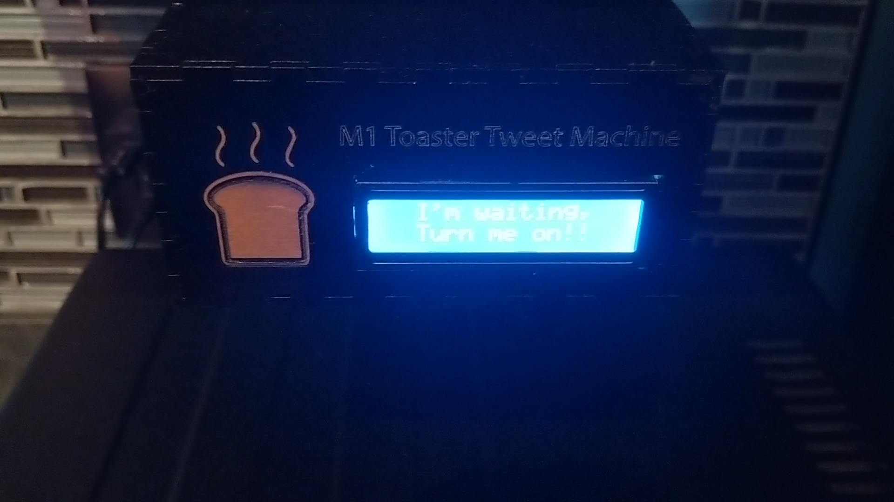
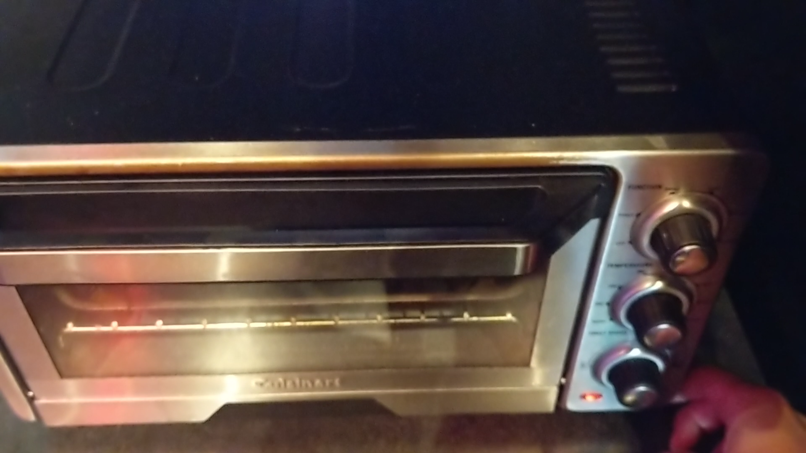
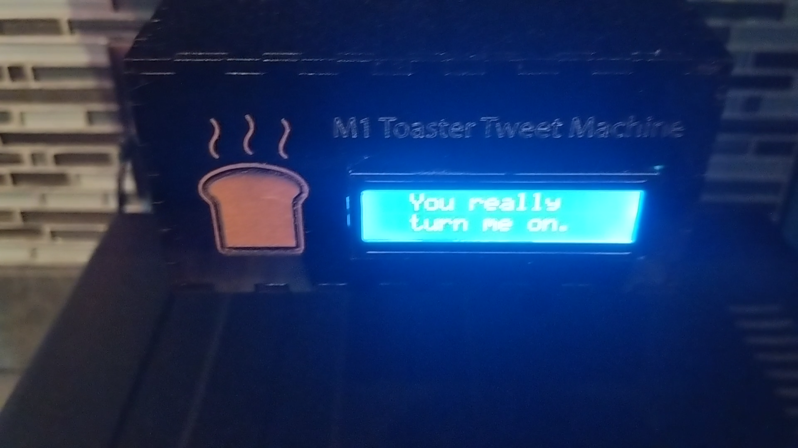

# Tweeting Toaster

Tweeting Toaster project needs 3 parts to work properly.

- [NODEMCU](http://nodemcu.com/index_en.html) v1.0 - open-source firmware and dev kit for IOT
- [TwitterOAuth](https://github.com/abraham/twitteroauth) to send tweet 
- a Toaster

#### Configuration

1. configure wifi in "NODE-MCU-v1.0_TweetOnLCD\src\main.cpp"

```
const char* ssid     = "####";
const char* password = "####";
```

2. install TwitterOauth and copy post-tweet.php, callback.php into TwitterOauth folder

3. configure post-tweet.php
```
define('CONSUMER_KEY', '######'); // add your app consumer key between single quotes
define('CONSUMER_SECRET', '#####'); // add your app consumer secret key between single quotes
define('OAUTH_CALLBACK', 'http://your.domain.com/callback.php'); // your app callback URL
```

#### Tweeing toaster in Action





[tweets](https://twitter.com/m1dev)


#### Note

*NODE MCU v1.0 has pin different layout than regular arduino*

pin definition

https://iotbytes.wordpress.com/nodemcu-pinout/

Use Platform IO for a better dev env

http://docs.platformio.org/en/latest/ide/clion.html


This project requires i2c library so you need to find right i2c address b4 run the project.
download and run scanner Arduino sketch to get i2c address.


